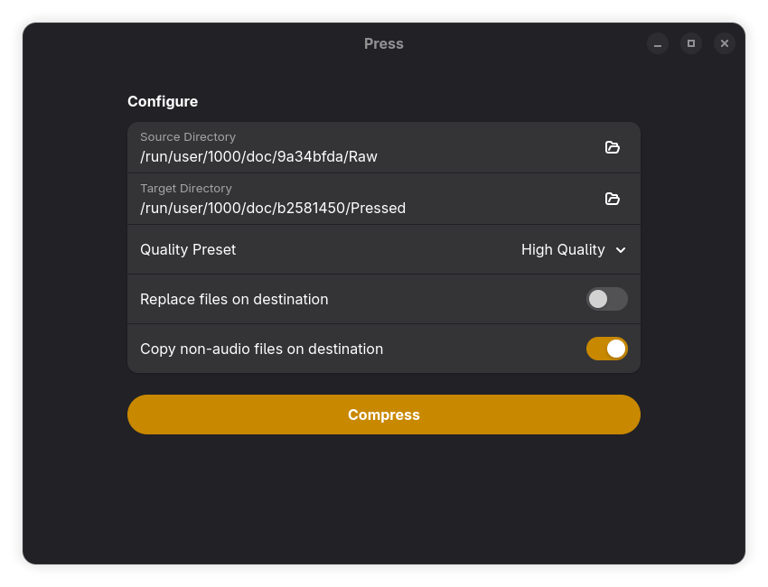
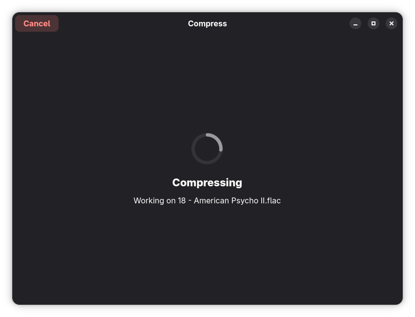
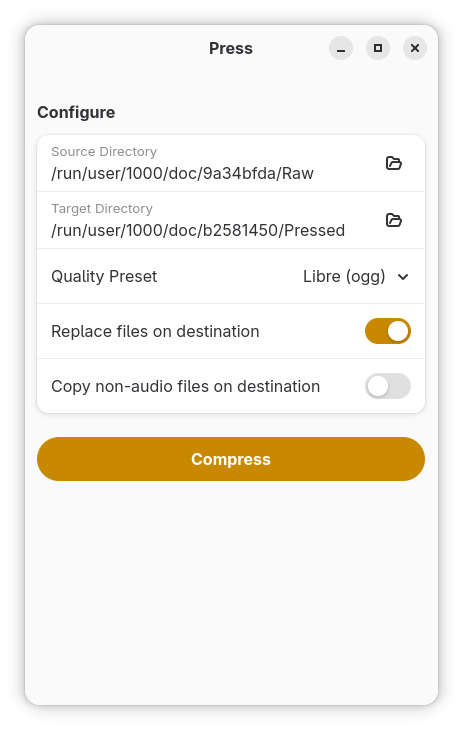

<h1 align="center">
    
     
    Press
</h1>

Music library compressor

> [!NOTE]
> Want to contribute? [CONTRIBUTING](CONTRIBUTING.md).
>
> Want to help translate? [Translating docs](/docs/translate.md).

Compress your whole music library with pre-made quality presets, in a few clicks.

- Easy to use interface
- Select you whole library
- Copy non-audio files over
- Merge or replace existing files
- Select from some pre-made quality presets
- Create your custom quality of choice
- Read from counless formats with GStreamer

### Showcase

## Installing

> :construction: TODO
>
> in the mean time: you can [manually compile it](/docs/developers.md)

## Integrating custom formats and presets

Currently, only a few formats are supported out of the box.

If you'd like to add more, checkout [Advanced presets](/docs/advanced_presets.md).

When you're done, make sure to [contribute your configuration](CONTRIBUTING.md)!

## Supporting

If you wish to support my work, lmk by opening an issue.
